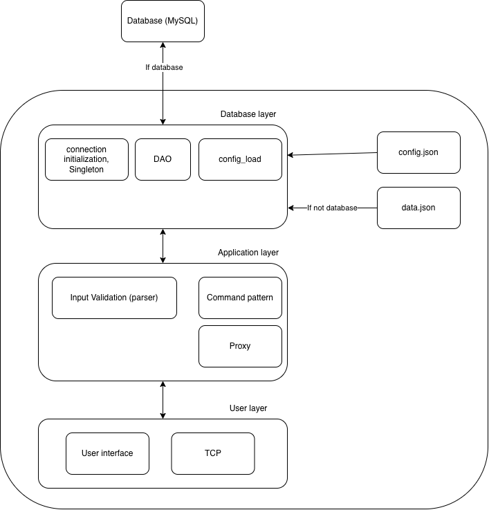

# P2P-bank-system
- This project is a bank system CLI application for managing accounts and transactions.
- The project is built on a P2P architecture and 3-tier architecture



## Project structure

```text
.
├── LICENSE
├── README.md
├── config.json
├── data
├── doc
│    └── app_design.png
├── main.py
├── my_lib
│        └── my_library    <--- library with reusable code
│           
└── src
    ├── app 
    │    ├── app.py
    │    ├── commands
    │    │       ├── ab.py
    │    │       ├── ac.py
    │    │       ├── ad.py
    │    │       ├── ar.py
    │    │       ├── aw.py
    │    │       ├── ba.py
    │    │       ├── bc.py
    │    │       └── bn.py
    │    ├── dispatcher_factory.py
    │    ├── ip_detect.py
    │    ├── parse.py
    │    ├── proxy.py
    │    └── response.py
    ├── database
    │    ├── dao
    │    ├── database.py
    │    ├── mysql_db.py
    │    ├── sql
    │    └── sqlite_db.py
    └── ui
        └── tcp_server.py

```

---

## Instalation and setup
- This is the guide to installation and startup of the application
### Prerequisites
- MySQL database
- MySQL workbench
### 1. MySQL database setup
#### 1.1 Connection creation
1. open MySQL workbench
2. create a new connection
3. enter the following information:
```text
- Connection Name: BankRoot
- Username: root
- Password: <Your root password>
- Hostname: 127.0.0.1
- Port: 3306
```
4. Click test connection
5. Click Ok and connect


#### 1.2 User and database creation
1. Paste the following SQL code:
```mysql
create database p2p_bank;

create user 'p2p_user'@'localhost'
identified by 'password';

grant select, insert, update, delete, create , references, index
on p2p_bank.*
to 'p2p_user'@'localhost';

```
- this creates a user with name p2p_user and with password = password

#### 1.3 Database configuration
- Edit the user, password and if so the database in the configuration file config.json
- example configuration:
```json
{
  "host": "127.0.0.1",
  "user": "p2p_user",
  "password": "password",
  "database": "p2p_bank",
  
  "sqlite_path": "data/p2p_bank.db",

  "listen_host": "0.0.0.0",
  "listen_port": 65525,

  "remote_port": 65525,

  "command_timeout_sec": 5,
  "client_timeout_sec": 30
}

```
- Make sure the credentials match the database user you created

### Clone or download .exe file
#### 1. Clone
1. On Github copy the url and clone the project into your environment (VS code, PyCharm ....)
2. download the requirements 
```commandline
pip install -r requirements.txt
```

3. from the project root run the main.py file.
#### 2. Downloading .exe file from releases
1. Download the .zip file that contains config.json, bank_service.exe and README.md
2. Follow the instructions in the README.md file.

